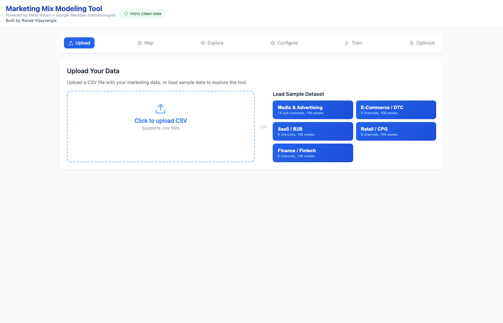

# Marketing Mix Modeling Tool

A **100% client-side** Marketing Mix Modeling (MMM) app that runs entirely in your browser — no server, no signup, no data upload. Load a CSV (or one of the built-in sample datasets), and model how your marketing channels drive your KPI, then optimize your budget.

### ▶️ Live app: **https://ronakvijayvergia.github.io/mmm-tool/**

> Your data never leaves your browser. All modeling runs locally in JavaScript — no API calls, no server storage, no tracking.



---

## What it does

Work through six steps along the top of the app:

| Step | What you do |
|------|-------------|
| **Upload** | Drop a CSV or load a sample dataset (Media & Advertising, E-Commerce, SaaS, Retail, Finance) |
| **Map** | Tell the tool which columns are your date, marketing spend, and KPI |
| **Explore** | Visualize spend and KPI trends over time |
| **Configure** | Pick adstock (carryover) and saturation (diminishing returns) settings |
| **Train** | Fit the model and see channel contributions, ROI, and fit quality |
| **Optimize** | Reallocate budget to maximize results, hit a target, or build scenario curves |

## Modeling approach

- **Two methodologies**: Ridge Regression (Meta Robyn style) and Bayesian MAP (Google Meridian style)
- **4 adstock types**: Geometric, Weibull CDF, Weibull PDF, Binomial
- **4 saturation curves**: Hill, Negative Exponential, Logarithmic, Power
- **Bootstrap confidence intervals** on coefficients
- **Time-series cross-validation** (expanding window)
- **Grid search** with Pareto-optimal model selection (NRMSE vs DECOMP.RSSD)
- **Budget optimizer** with maximize / target / scenario-curve modes

## Run it locally

It's a single static `index.html` — just open it, or serve the folder:

```bash
python3 -m http.server 8765
# then open http://localhost:8765/
```

CDN dependencies (React, Recharts, Lucide, Babel) load on first open, so the first load needs internet.

## Tech notes

- Pure HTML/JSX, transpiled in-browser by Babel Standalone — no build step
- Works in modern Chrome, Firefox, Edge, and Safari
- Hosted free on GitHub Pages from the repo root

---

Built by **Ronak Vijayvergia**.
